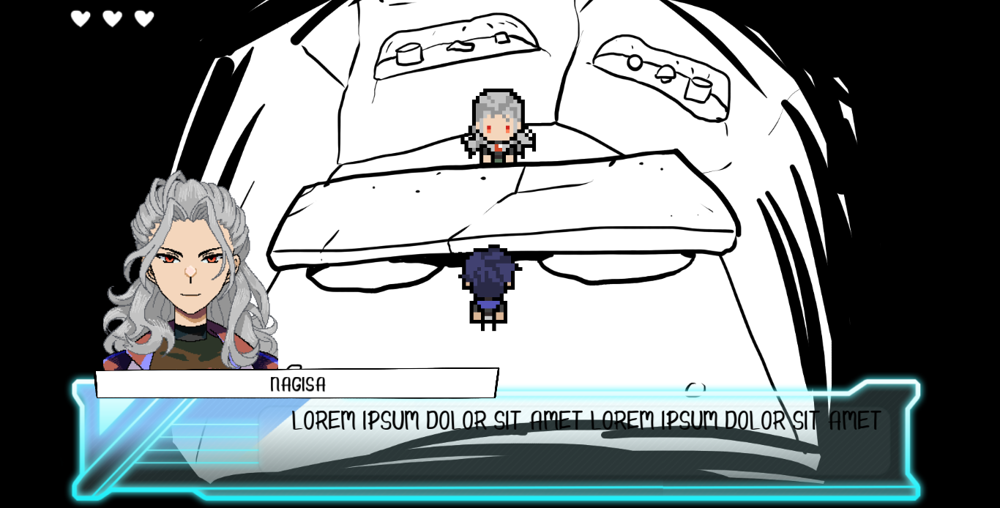

## Hey there :D
> Risky Venus
全部差し出す覚悟で
もっと抱きしめあうのさ
Addict!

### Intro
any pronouns / 18+ / I'm pardi, but calling me with the pony's name is fine

I love to draw, listening to vocaloid/Vtubers/SynthV/Utau/Utaite, and reading books

Feel free to boop or starting conversations with me! As long as you're not rude and I'm not AFK
I'll definitely reply

I be AFK often in-game.
all my ponies are C+H 😉.

### Before you interact
I'm not a minor, but if you're comfortable with it then go ahead. I won't talk about personal life unless you start it first. I'll never pry, just replying.
Also please tell me if I'm being awfully close, I'm kinda awkward.
I never do accidental boop-ing, if I boop you that means I like your skin. 

I won't interact with you if you have DNIUF/TD in your name (I respect the wish of DNIUF, but not TD bcs it's an actual disorder and such a term shouldn't be used lightly unless you actually have it. Either way I won't be able to interact with you, so I'm just saying.) 

If you have the busy status on (⛔) I might be reluctant.. (unless you're in my friendlist)

### Before add friend!!
Offline mode is enabled so I won't appear in your friendlist and my name won't appear green in your screen...
I also don't know how to keep friend. I guess I'm just boring, but if you're fine with it, I'm replying.

### Don't interact if
- You don't like other people having the same interest as you. That's weird and kinda rude 🤔.
- Racist, ableist, too political, extremely rude, etc.
- You can't handle jokes... (I put /j. Never too serious, just for fun.)

## Extra

### Likes
Roleplay / Regular chat is OK! 😸
I don't mind if you dislike what I like btw. I have too many.

I have some ponies from: MLP, Ensemble Stars, Bungou Stray Dogs, Touhou project, Jojo's, Twisted Wonderland, Hypnosis Microphone, Mahoyaku, Land of the Lustrous and a lot of OCs :) 

I'm also into Beyblade (ori, metalfight, burst), Yu-Gi-Oh!! (0-8 except SEVENS, yes I like Go Rush!), Ina11, Saint Seiya, HxH, CSM, Danganronpa, FGO, MCU, Paradox Live, Handead Anthem, A3!, K Project, Tekken, KOF, Guilty Gear, Yuru camp, Evangelion, Saiki, Ansatsu Kyoushitsu, 7DS, Tokrev, Beastars, etc etc.

I read MangaPlus regularly. PPPPPP, Sakamoto Days, Even if you slit my mouth, Cipher academy, and Dandadan are so DAMN great man I totally recommend these manga. Oh also Shonen Magazine (Blue Lock, Mokushiroku).
- I think these joseimuke games really do have shonen plot (except A3! & i7 which is quite shoujo imo). Feel free to fight me on this. Yeah A3 has spies and i7 has bombs but imo those ain't wild enough (I love A3 and i7 for the record, those just not that shonen to me).
- I'm also an avid webtoon reader pls help. And japanese webtoon such as Nanbaka (have you seen Kojirou?)
- And a gamer as well.. other than gacha I also like RPG maker games such as End Roll, Ib, Yume Nikki (Dw I'm avoiding Okegom)

### Favorites
- HiiroP
- AlkaloidP, EdenP, SwitchP
- Pomefiore & Octavinelle
- Autumn & Spring troupe (I really love Sakyo & Itaru overall)
- Rustica loml and the other west wizards
- Fyodor (tbh Chuuya is objectively better)
- Chiaki Nanami, Chihiro Fujisaki (they don't deserve to be in dgrp and I like their personality)
- Yanfei is so gorgeous and for what
- etc

### Dislikes
I don't like conversations that I can't follow. 

I have no characters I particularly dislikes. Mori Ougai is the closest one.

# Will this Enstars fangame be finished?
place your bet 

### Update 12/10/22

### Update 12/14/22
I'm procrastinating

<!---
pardi-real/pardi-real is a ✨ special ✨ repository because its `README.md` (this file) appears on your GitHub profile.
You can click the Preview link to take a look at your changes.
--->
